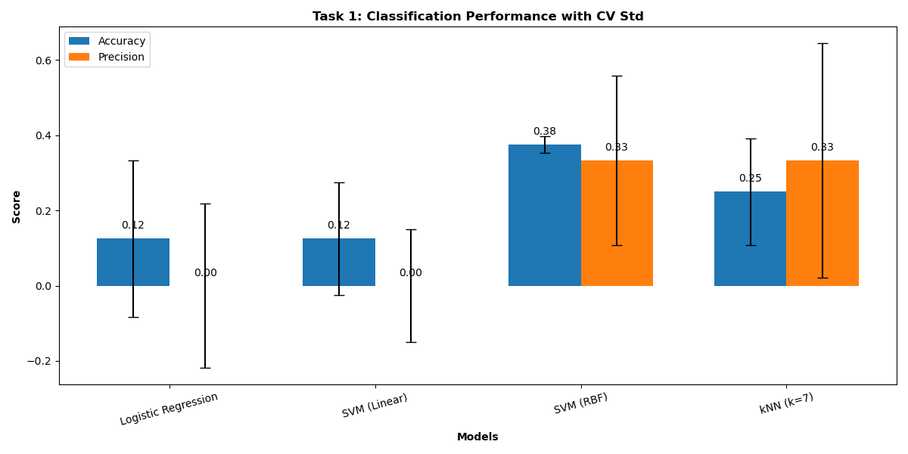
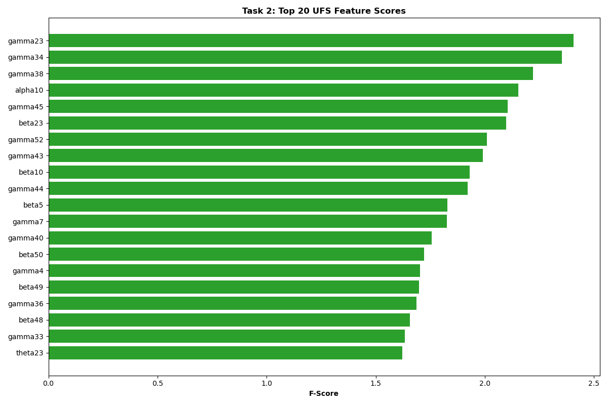
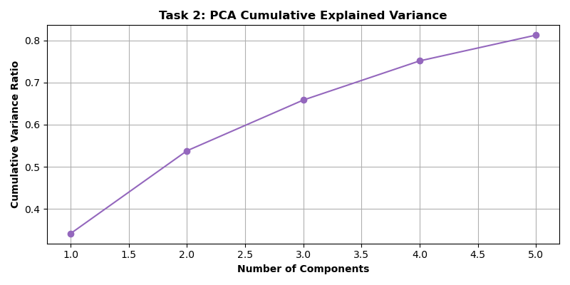

# Results

## Task 1: Classification

**Setup:** 80% train (32 samples), 20% test (8 samples), stratified split, standardized features.

**Models and Hyperparameters:**

- Logistic Regression: C=0.01, max_iter=2000, balanced weights  
- SVM (Linear): C=0.1, balanced weights  
- SVM (RBF): C=0.01, gamma=0.001, balanced weights  
- kNN: k=7  

**Performance:**

<pre><code>Logistic Regression: Accuracy = 0.125, Precision = 0.000
SVM (Linear): Accuracy = 0.125, Precision = 0.000
SVM (RBF): Accuracy = 0.375, Precision = 0.333
kNN (k=7): Accuracy = 0.250, Precision = 0.333</pre></code>

**Reasoning:**  
SVM (RBF) leads with 0.375 accuracy and 0.333 precision, suggesting it captures some non-linear patterns in EEG data (e.g., alpha10, gamma34). Tuned parameters (C=0.01, gamma=0.001) help it outperform others, though performance is modest due to small sample size.

kNN (k=7) at 0.250 accuracy finds local clusters, but 320 features overwhelm the distance metric in a 40-sample dataset, limiting effectiveness.

Logistic Regression and SVM (Linear) both at 0.125 accuracy fail to predict class 1 (precision 0.000), likely due to noisy or non-linearly separable data overwhelming linear boundaries.

High dimensionality (320 features) vs. small sample size (40) amplifies noise, causing poor generalization, especially for linear models.

---

## Task 2: Feature Selection

**Methods:**

- UFS: Top 5 features by F-score (f_classif).  
- RFE: Recursive elimination with SVM (Linear), 5 features.  
- PCA: Top 5 approximate features by component weights.  

**Results:**

<pre>UFS: ['alpha10', 'gamma23', 'gamma34', 'gamma38', 'gamma45']
RFE: ['alpha41', 'delta43', 'theta1', 'theta23', 'gamma34']
PCA: ['beta32', 'alpha44', 'alpha15', 'delta2', 'theta6']</pre>

### Explanation:

**Similarities:**  
Limited overlap (e.g., `gamma34` in UFS and RFE) occurs where features have strong univariate significance (UFS) and contribute to linear separation (RFE), though noise reduces consistency.

**Differences:**  
UFS selects standalone predictors (e.g., `gamma38`), RFE picks complementary features for SVM (Linear) (e.g., `theta23`), and PCA highlights variance-heavy features (e.g., `beta32`), reflecting distinct goals: correlation, model utility, and variance.

High feature count (320) and small sample size (40) amplify noise, affecting consistency across methods and contributing to poor classification performance.

---

### Visualizations

- **Task 1 - Classification Performance:** Grouped bar chart with accuracy and precision, including CV standard deviation error bars.

- **Task 2 - UFS Feature Scores:** Horizontal bar chart of top 20 features by F-score.

- **Task 2 - PCA Variance:** Cumulative explained variance plot for 5 components.

---

### Discussion

**Challenges:**  
Small dataset (40 samples) and high dimensionality (320 features) lead to noise dominance and overfitting risks.

Test set (8 samples) is too small for reliable evaluation, causing volatile results (e.g., earlier SVM (Linear) at 0.750 vs. now 0.125).

**Improvement:**

- Collect more EEG data to improve model robustness.
- Explore ensemble methods or deep learning with larger datasets.
